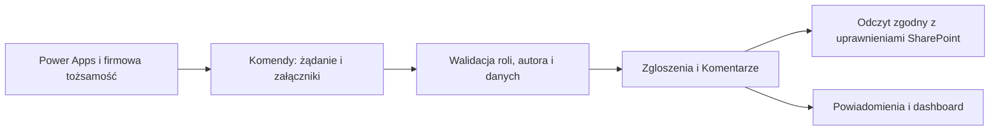

# Projekt rozwiązania

## Zakres i decyzje startowe

Aktualna specyfikacja użytkownika zastępuje wcześniejszy podgląd strony bez logowania. Power Apps używa firmowej sesji Microsoft 365; nie dodajemy własnego ekranu logowania. W aplikacji produkcyjnej nie ma przełącznika umożliwiającego samodzielne nadawanie roli.

„Moje zgłoszenia” oznacza zgłoszenia konkretnej osoby, zgodnie z ostatnią specyfikacją — nie wszystkie zgłoszenia lokalu. Wszystkie aktywne lokale i magazyny są dostępne do wyboru; specyfikacja nie ogranicza użytkownika do przypisanego MPK.

### Przyjęte definicje do zatwierdzenia w pilotażu

- Krytyczne: Status nie jest Zamknięte ani Odrzucone, a PoziomAlertu = Wysoki LUB BlokujeSprzedaz = Tak. Wysoki alert sam w sobie uruchamia wskazane przez użytkownika powiadomienie. Blokada sprzedaży nie zmienia potajemnie wybranego poziomu.
- Pierwsza reakcja: pierwsze ręczne przypisanie, merytoryczny komentarz koordynatora lub zmiana statusu. Automatyczne przypisanie dyżurnego i aktualizacja techniczna nie liczą się jako reakcja.
- 48 h: godziny kalendarzowe, bez kalendarza świąt i bez zatrzymania licznika w weekend. Zmiana tej reguły wymaga osobnego kalendarza pracy.
- Termin realizacji: data i godzina, przechowywane w UTC, pokazywane w czasie polskim. Brak terminu nie oznacza przekroczenia.
- Koszt: PLN, nieujemny, 2 miejsca dziesiętne, domyślnie pusty (nieznany). Przy zamknięciu wymagany; 0 oznacza naprawę bez kosztu. Podział netto/VAT/brutto nie został ustalony — przed rozliczeniami finansowymi należy jednoznacznie wybrać podstawę i opisać ją na etykiecie. Ten rejestr nie jest systemem księgowym.
- Średni czas realizacji: średnia z DataZamkniecia − DataZgloszenia wyłącznie dla Zamkniętych. Jednostka: godziny kalendarzowe. Odrzucone nie wchodzą do średniej; brak zamkniętych daje „Brak danych”, nie 0 h.
- Nieaktywne obiekty pozostają w historii, ale nie można wskazać ich w nowym zgłoszeniu. Dezaktywacja nie zmienia wcześniejszych danych.
- Załączniki: startowo maksymalnie 5 plików po 10 MB, JPG/JPEG/PNG/PDF; do zatwierdzenia przez firmę. Kontrola także w przepływie, nie tylko w formularzu.

## Role i dostęp

| Funkcja | Użytkownik | Koordynator | Administrator |
|---|---|---|---|
| Dodanie zgłoszenia i załączników | Tak | Tak | Tak |
| Lista zgłoszeń | Własne | Wszystkie | Wszystkie |
| Komentarze | Do własnych | Do wszystkich | Do wszystkich |
| Zmiana statusu, alertu, przypisania i terminu | Nie | Tak | Tak |
| Koszt, zamknięcie, odrzucenie | Nie | Tak | Tak |
| Dashboard ogólny | Nie | Tak | Tak |
| Zarządzanie rolami, obiektami, konfiguracją | Nie | Nie | Tak |
| Usuwanie historii zgłoszeń | Nie | Nie | Poza aplikacją, zgodnie z polityką retencji |

Role są biznesowe. „Administrator aplikacji” nie oznacza administratora całego Microsoft 365. Brak aktywnego wpisu Role oznacza odmowę dostępu, a nie automatyczne nadanie Użytkownika. Zmiana/dezaktywacja roli wymaga odebrania lub zmiany odpowiednich uprawnień do danych; ukrycie przycisku nie wystarcza.

## Listy

Dokładne nazwy i typy wszystkich kolumn znajdują się w schemat-list.json. Nazwy wewnętrzne są bez spacji i polskich znaków; etykiety przyjazne użytkownikowi dodaje się w Power Apps. ID, Created, Modified, Author i Editor to systemowe pola SharePoint, nie duplikujemy ich w schemacie.

### Trzy listy z zamówienia

**Lokale**: Miasto, NumerLokalu (tekst, unikatowe), NazwaLokalu, Typ (Lokal/Magazyn), Aktywny. Dodatkowo Lokalizacja zachowuje terminal, a WierszZrodla umożliwia audyt importu.

**Zgloszenia**: wszystkie 16 pól z opisu użytkownika. Dodano BlokujeSprzedaz, DataPierwszejReakcji, EmailKoordynatora (indeks filtrowania), KluczZadania (ochrona przed podwójnym utworzeniem) i Lokalizacja. Załączniki są standardowymi załącznikami elementu listy. Nazwa, MPK i lokalizacja to kopia wartości w momencie zgłoszenia, dzięki czemu późniejsza zmiana słownika nie przepisuje historii.

**Role**: Uzytkownik (Osoba), Email (unikatowy tekst małymi literami), Rola (trzy wartości) i Aktywny. Wpis biznesowy nie tworzy konta Microsoft 365. Tożsamość zawsze weryfikuje się na podstawie konta, nie wpisanego w formularzu e-maila.

### Cztery dodatki wynikające z funkcji i bezpieczeństwa

**Komentarze**: ZgloszenieId, Tresc, Autor, DataKomentarza, KluczZadania. Jeden rekord na komentarz. Komentarze zwykłe i notatki koordynatora są widoczne dla autora zgłoszenia; osobnych poufnych notatek nie wprowadzono bez wymagania. Powiązanie liczbowe musi być walidowane w przepływie.

**Komendy**: bezpieczna kolejka żądań zmiany, także do przejściowego przesłania załączników. Użytkownik może zapisać w niej swoje żądanie, ale nie może sam zmieniać statusu ani kosztu w Zgloszenia. Pola: Operacja, ZgloszenieId, Dane (JSON), Stan, WynikId, Komunikat, KluczZadania. Stan i WynikId z klienta nigdy nie stanowią dowodu wykonania operacji. Autorytatywny klucz przetwarzania: GUID listy Komendy + systemowe ID elementu, a nie dowolny GUID przesłany przez aplikację.

**Konfiguracja**: Klucz, Wartosc, Opis; brak haseł i sekretów. Parametry oraz gotowy, okresowo wyliczany zestaw agregatów dashboardu. Dane ogólne dostępne wyłącznie centrali/adminowi.

**DziennikPowiadomien**: unikatowy Klucz, ZgloszenieId, Kanal, Typ, Stan, DataWyslania, Blad. Umożliwia kontrolę powtórzeń, awarii i ręczne wznowienie. Nie przechowuje załączników ani tokenów.

## Dlaczego kolejka Komendy

Ukryte karty Status/KosztNaprawy i właściwość DisplayMode nie są zabezpieczeniem przed modyfikacją listy bezpośrednio przez API. Użytkownicy nie otrzymują prawa edycji docelowej listy Zgloszenia. Ich zmiany przechodzą przez przepływ, który odczytuje systemowego Author z kolejki, sprawdza Role i wykonuje wyłącznie dozwoloną operację. To celowe rozszerzenie trzech list z briefu.

### Docelowa macierz uprawnień SharePoint

- Witryna: prywatna, bez szerokiej domyślnej grupy Edycja. Nie nadawać pracownikom praw site owner/design/manage lists.
- Lokale: odczyt dla aktywnych użytkowników; zmiany przez sprawdzoną komendę administratora lub przez administratora technicznego.
- Role: użytkownik/koordynator czyta tylko własny wpis; administrator biznesowy ma podgląd wszystkich przez zatwierdzony mechanizm, a zapis przez przepływ. Pierwszy administrator dodawany przez właściciela witryny, nigdy na zasadzie „pierwszy odwiedzający”.
- Komendy: własne wpisy, możliwość dodania i edycji do momentu przyjęcia. Ustawić odczyt/edycję własnych elementów oraz odebrać usuwanie i zarządzanie listą. Po przyjęciu żądania przepływ odbiera autorowi edycję konkretnego elementu, a następnie odczytuje utrwalone dane i pliki. Zapewnić odczyt wyniku autorowi. [Ustawienia dostępu listowego](https://pnp.github.io/powershell/cmdlets/Set-PnPList.html)
- Zgloszenia: tylko tożsamość obsługi przepływów i administrator techniczny zapisują; koordynatorzy czytają wszystkie; autor zgłoszenia dostaje odczyt konkretnego elementu. ACL ustawić przed zwróceniem sukcesu, bez etapu publicznego odczytu. Weryfikować dostęp także do adresów załączników.
- Komentarze: odczyt jak dla powiązanego zgłoszenia, zapis tylko przez przepływ. Elementy początkowo prywatne dla obsługi, potem nadanie odczytu zainteresowanym.
- Konfiguracja i DziennikPowiadomien: wyłącznie centrala/administrator zgodnie z potrzebą; pracownicy lokali nie czytają globalnych agregatów, adresów ani logów.

Canonical Author w Zgloszenia może być kontem obsługi przepływu. Dlatego „własne” określają zweryfikowane Zglaszajacy i EmailZglaszajacego plus ACL, nie mechanizm „Created by = me” na tej liście. Role.Email powinien być znormalizowany; tożsamość z tokena/SharePoint jest nadrzędna wobec danych klienta.

Indywidualne uprawnienia zwiększają liczbę zakresów. Przed większą skalą należy ustalić archiwizację i podział okresowy; Microsoft zaleca ograniczanie unikatowych zakresów, a limit techniczny nie jest celem projektowym. [Limity i zakresy](https://learn.microsoft.com/en-us/troubleshoot/sharepoint/lists-and-libraries/error-share-break-inheritance)

## Obieg statusów

| Z | Dozwolone cele |
|---|---|
| Nowe | W realizacji, Odrzucone |
| W realizacji | Oczekuje na części, Oczekuje na informację, Zamknięte, Odrzucone |
| Oczekuje na części | W realizacji, Zamknięte, Odrzucone |
| Oczekuje na informację | W realizacji, Zamknięte, Odrzucone |
| Zamknięte / Odrzucone | Brak; ponowne otwarcie nie jest w zakresie MVP |

Przypisanie wymaga aktywnej roli Koordynator lub Administrator. Zamknięcie wymaga kosztu ≥ 0 i niepustego KomentarzZamkniecia; DataZamkniecia ustawiana przez przepływ. Odrzucenie wymaga uzasadnienia w KomentarzZamkniecia, także zapisuje datę zakończenia; nie wymaga kosztu. Edycja zakończonego zgłoszenia jest blokowana. Wszystkie operacje zapisują wersje SharePoint; techniczne wersjonowanie nie zastępuje polityki retencji i kopii bezpieczeństwa.

## Dashboard i raportowanie

Kafelki oraz wykresy dla koordynatora/administratora. Domyślny zakres: cała historia; filtr dat ogranicza populację według DataZgloszenia, a widoczne etykiety muszą podawać zakres. Kafelki: Wszystkie, Nowe, W realizacji, Zamknięte, Krytyczne. Statusy oczekiwania i odrzucenia pozostają w liczbie Wszystkie, mimo że nie mają osobnych kafelków.

Wykresy: liczba wg Miasto, RodzajUsterki, NumerLokalu + NazwaLokalu. Dwie placówki o tej samej nazwie nie mogą się zlewać. Średni czas jak w definicji powyżej; należy pokazać liczbę zamkniętych użytych w obliczeniu. Koszty sumować tylko znane, z jawną informacją o nieuzupełnionych wartościach.

Nie liczyć całej listy SharePoint przez niedelegowalne CountRows/GroupBy w aplikacji. Zamiast tego przepływ czyta pełne dane stronicami w zakresach czasu/ID i zapisuje ukończony zestaw agregatów jako JSON pod kluczem DashboardSnapshot w Konfiguracja. Zachować poprzedni poprawny snapshot w razie błędu; pokazać datę aktualizacji i ewentualną nieaktualność. Dla dużych danych warunki, indeksy i podział zapytań trzeba przetestować z progiem listy. [Delegowanie i limit lokalnej kolekcji](https://learn.microsoft.com/en-us/power-apps/maker/canvas-apps/delegation-overview)

Na MVP dashboard pokazuje snapshot odświeżany np. co godzinę. Filtry dat wymagają snapshotów dla wybranych okresów lub zatwierdzonego przepływu raportowego, nie filtrowania już zagregowanych wszystkich danych. Eksport do CSV/Excel jest dodatkową czynnością administratora, z identycznym zakresem uprawnień i zabezpieczeniem komórek rozpoczynających się od =, +, - lub @.
